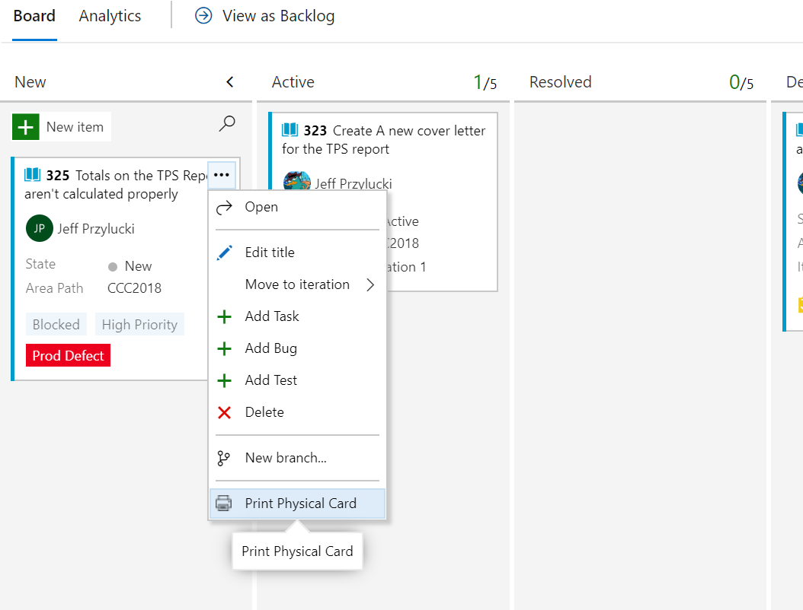
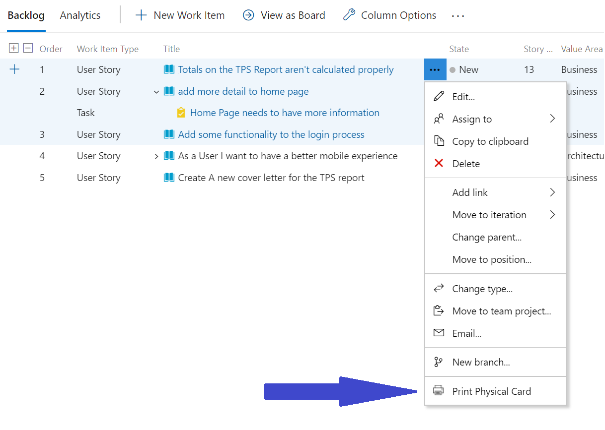
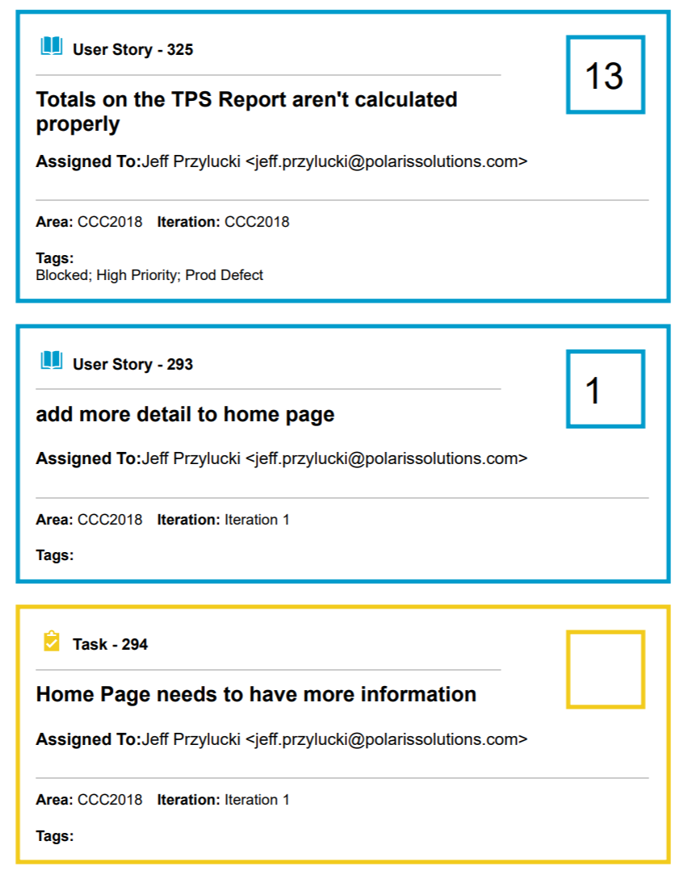

# Print Physical Card

This extension adds the ability to print cards to use on a physcial Kanban board. The extension adds an action to the context menu for Work Items so that it is available
within your Boards, Work Item lists, query results, or Work Item view from the context menu drop down when you click the elipsis (...).

This will allow you to print ANY Work Item type, from ANY template, even custom templates or work items. Some work item types may make more sense to print than others... So printing a User Story, or Feature or Epic etc... work well.. Where printing a Test Case's Share Step work item, while technically works, may not provide anything valuable.

This Extension supports multi-selecting Work Items, and will print multiple cards to a page and will properly Page-Break for every three cards. You can multi-select different Work Item Types (User Stories and Tasks for example) to print out cards as needed.

## Printing

- Open a work item, click the elipsis (...), click `Print Physical Card` OR
- Right-click on a work item and select `Print Physical Card` OR
- Multi-select work items (Ctrl-select or shift-select multiple items) right click and select `Print Physical Card`

## Fields Printed

- Work Item Type
- Work Item ID Number
- Work Item Title
- Assigned To
- Story Point / Business Value / Original Estimate (depends on work item type)
- Area
- Iteration
- Tags

## Credits

- Based on [Pretty Card](https://github.com/ryanjones/pcards) by Ryan Jones and
  [WIPrint](https://github.com/MrTarantula/WIPrint)

## Credits

- Based on [WIPrint](https://github.com/MrTarantula/WIPrint)
- Dave Van Vliet - Card Layout
